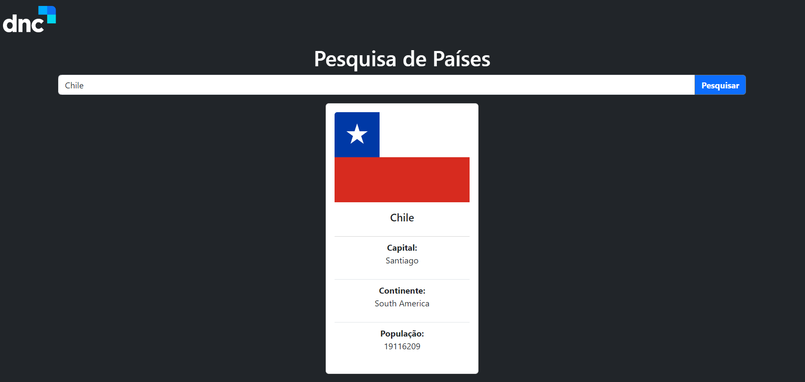

	

	<h1>Site para busca de informações de sobre um país</h1>

### O que é? 🤔
Site para busca de informações de um país utilizando uma API.

### Quais tecnologias foram usadas? 💻
- HTML5
- Bootstrap5
- Javascript

### Está online? 📡
SIM! Basta [clicar aqui](----link netlify----) para visualizar o site que está hospedado nos servidores da Netlify.

by Murillo Couto 
[GitHub](https://github.com/MurilloCouto)
